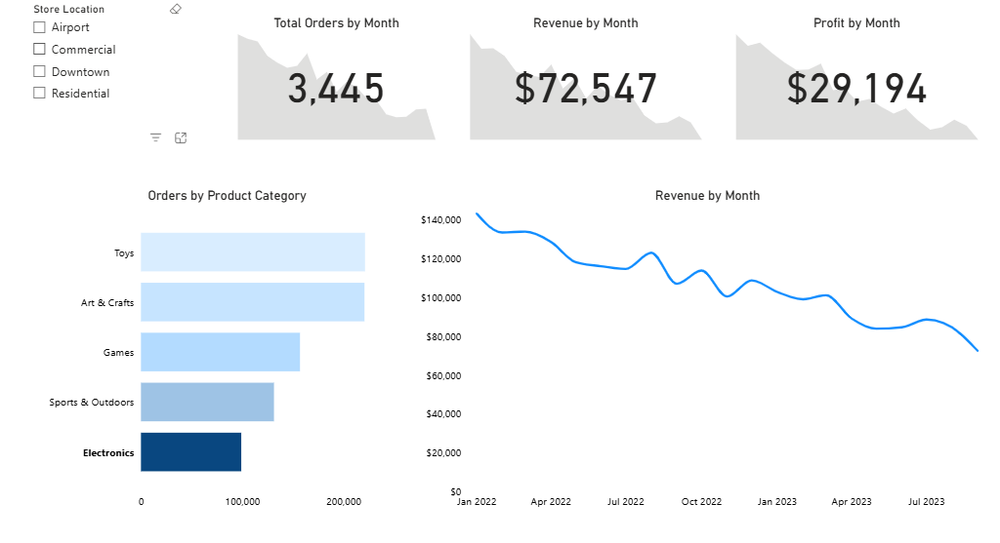
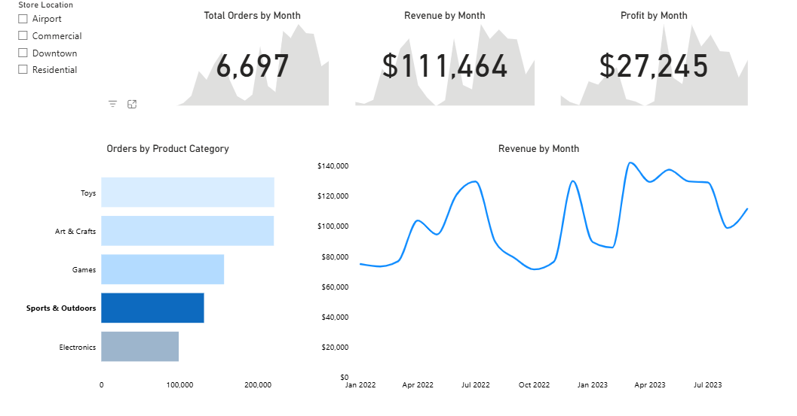
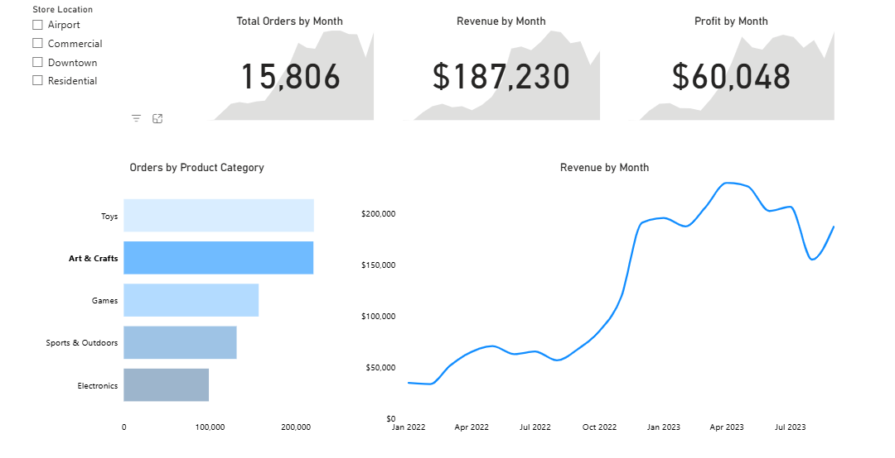

# Mexico Toy Sales

**Sales & inventory data for a fictitious chain of toy stores in Mexico called Maven Toys, including information about products, stores, daily transactions, and current inventory levels at each location.**

[View interactive dashboard here on the Power BI Service](https://app.fabric.microsoft.com/view?r=eyJrIjoiNGQ0Mjg3MDAtNTg2Ny00ZmZjLTg3MmItNWM0OTExN2Y0MmVlIiwidCI6Ijc1ODk4MjEwLWZiNTUtNDk2ZS1iMDEyLWUxYzAzZDEzYWI2MCJ9)

**Recommended Analysis**

- Which product categories drive the biggest profits? Is this the same across store locations?

- Can you find any seasonal trends or patterns in the sales data?

- Are sales being lost with out-of-stock products at certain locations?

- How much money is tied up in inventory at the toy stores? How long will it last?

## Introduction:

### OBJECTIVE 1: CONNECT AND PROFILE THE DATA

**Connect to the sales, products, stores, and calendar csv files**
- Review table columns, check for blank or null values, confirm that datatypes are accurately defined, and identify any primary and foreign keys

- Take a moment to profile the data.

- How many transactions were recorded?

- How many stores does Maven Toys operate?

- What are the lowest and highest priced products?

- Add calculated columns in the calendar table for ‘start of month’ and ‘start of week’

### OBJECTIVE 2: CREATE A RELATIONAL MODEL
**Load the tables to the data model and create relationships from the sales table to the products, stores, and calendar tables**

- Confirm that you are following data modeling best practices.

- Your model should take the form of a star schema, with 1:many relationships between fact and dimension tables

- Create a date hierarchy containing the ‘start of month’, ‘start of week’, and ‘date’ fields

- Hide all foreign keys in the sales table from the report view

### OBJECTIVE 3: ADD CALCULATED MEASURES & FIELDS
**Create calculated columns in the sales table to pull in ‘cost’ and ‘price’ from the products table, then use those fields to calculate the revenue and profit for each transaction**

- Create measures to calculate the count of orders (‘total orders’), sum of revenue (‘total revenue’), and sum of profit (‘total profit’)

- BONUS: Can you define new measures to calculate total revenue and profit without referencing any of the calculated columns in the sales table?

### OBJECTIVE 4: BUILD AN INTERACTIVE REPORT:
**Add KPI card visuals showing ‘total orders’, ‘total revenue’ and ‘total profit’ for the current month, along with monthly trends for each metric.**

 - Add a slicer to filter the report page by store location.

- Add a bar chart showing ‘total orders’ by product category, and a line chart showing ‘total revenue’ with the date hierarchy on the x-axis.

- Assemble the charts into a logical layout and adjust formatting, alignment and polish to finalize the report as you see fit.

## INSIGHSTS:

**1️⃣ KPI Cards (Top Summary)**

🔹 `Total Orders: 41,830`
- Indicates `strong overall sales volume`
- Order trend (sparkline) shows `fluctuations`, not consistent growth → demand varies month to month

🔹` Total Revenue: $658,194`
- Healthy revenue generation
Revenue trend shows `peaks and dips`, suggesting seasonality or promotions impacting sales 

🔹 `Total Profit: $180,445`
- Profit margin is roughly `27–28%`, which is `good`
Profit trend closely follows revenue → `costs are relatively stable`

  📌 `Insight`: Business is profitable, but revenue and orders are not stable every month.

2️⃣ **Store Location Slicer (Interactivity)**

- `Allows filtering by Airport, Commercial, Downtown, Residential`
Helps compare `which location contributes most to sales`
Useful for:
- Location-based performance analysis
- Regional decision-making

  📌 `Insight:` This slicer makes the report dynamic and decision-focused.

3️⃣ **Orders by Product Category (Bar Chart)**

🔹 `Best-performing categories:`
`Toys` – highest number of orders
`Art & Crafts
Games`

🔹 `Lowest-performing category:`
`Electronics`

  📌 `Insights:` Toys and Art & Crafts drive `maximum order volume`

Electronics may need:
- Better pricing
- Marketing
- Product review

4️⃣ **Revenue by Month (Line Chart)**

🔹`Key observations:`
- Revenue increases from early 2022
- `Major peak around late 2022 / early 2023`
- Slight decline after mid-2023

🔹 `Possible reasons:`

- Festive season or promotions
- New product launches
- Demand slowdown later
  
  📌 `Insight:` Revenue is `seasonal`, not linear. Planning should focus on peak months.

5️⃣ **Overall Business Insights (Important for Interviews)**

 ✔ Business has `strong order volume and profitability`

 ✔ Revenue depends heavily on `seasonal demand`
 
 ✔ `Toys & Art` categories are core revenue drivers 

 ✔ Electronics category needs `improvement`
 
 ✔ Interactive slicer improves `decision-making ability`
I 

**Additional Porject Images**

`Image_03`

`Image_04`

`Image_05`

`Conclusion:`
   - The Maven Toys business demonstrates solid fundamentals with consistent `profitability`. By addressing seasonal `variability`, improving Electronics category performance, and leveraging location-specific insights, the organization can unlock significant growth potential while maintaining operational `efficiency`.